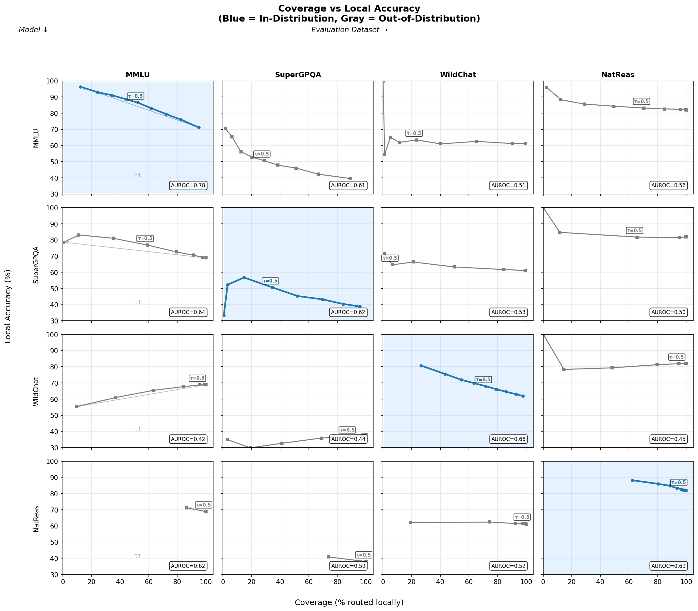
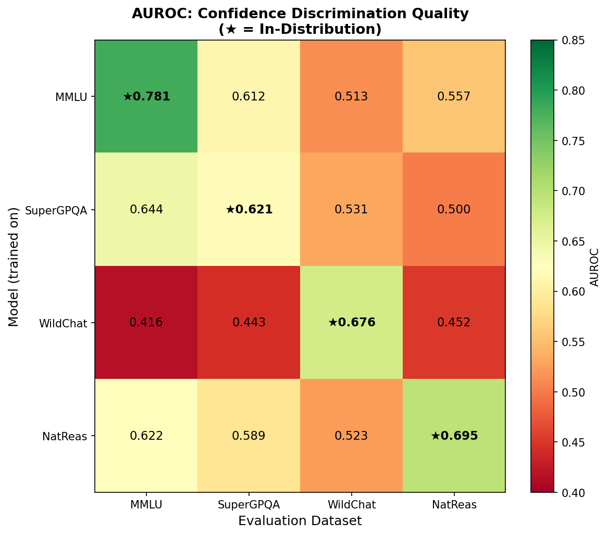
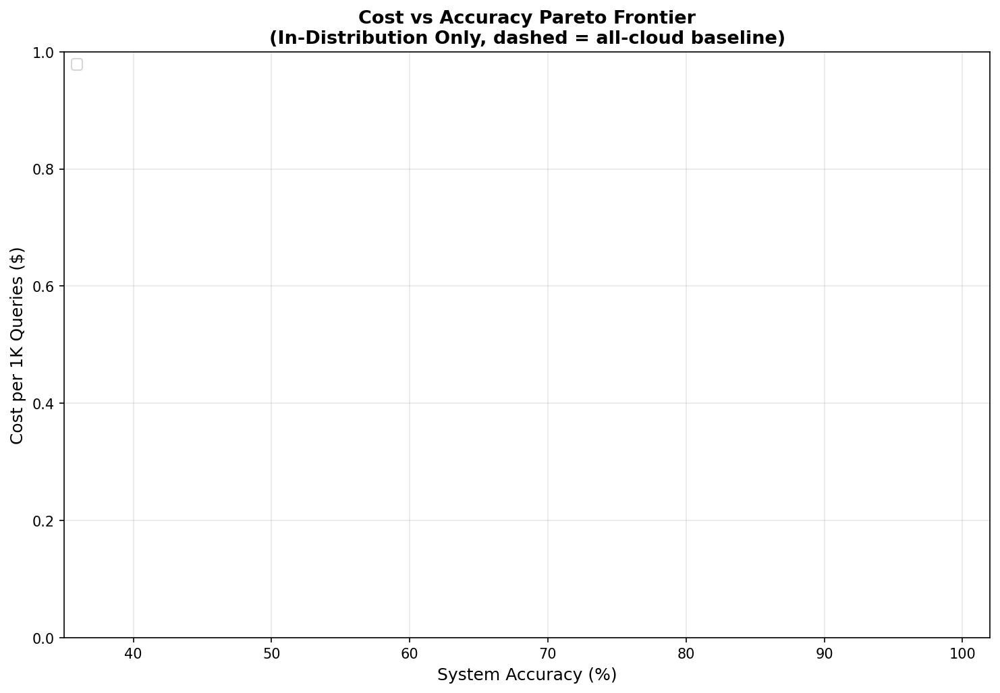
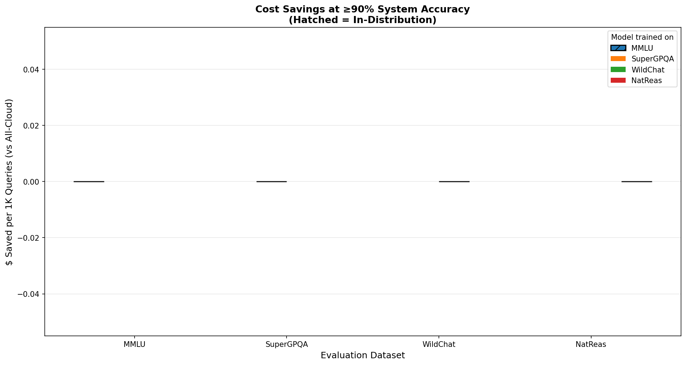
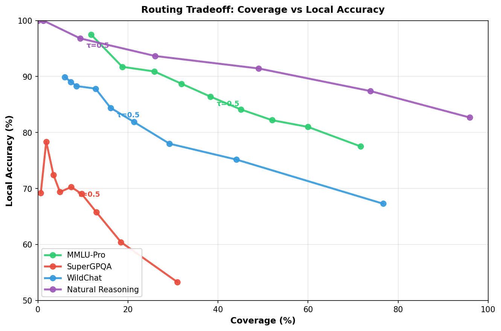
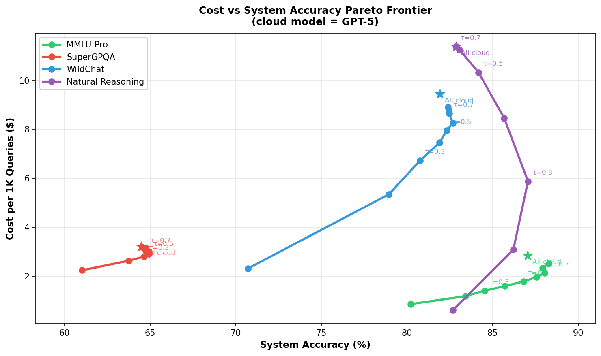
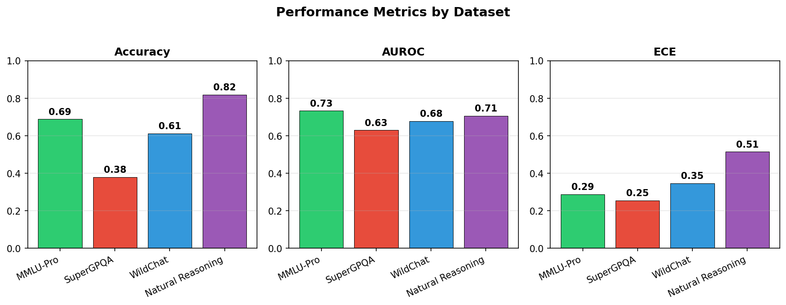
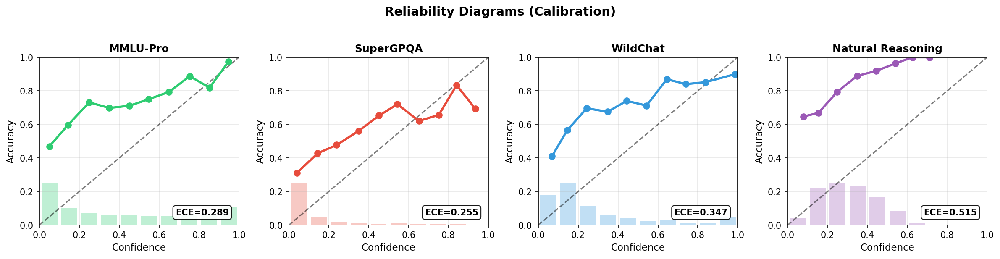
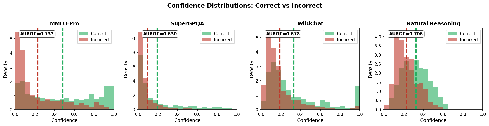

# Confidence Tokens: Cost-Efficient LLM Routing via Learned Confidence

Training language models with `<|CONF|>` suffix tokens for confidence estimation and intelligent routing between local and cloud inference.

## Overview

This project explores **confidence-based routing** — using a fine-tuned local model's self-assessed confidence to decide whether to answer locally or escalate to a more capable (and expensive) cloud model.

**Core Idea:** Insert a `<|CONF|>` token after the question. Train a linear probe on the token's hidden state to predict answer correctness. At inference time, route locally if confidence ≥ τ, otherwise send to cloud.

```
{question} <|CONF|> {answer}
           ↑
    Linear probe here → confidence score → routing decision
```

---

## Key Results

### TL;DR

1. **Confidence-based routing works in-distribution** — MMLU model achieves 0.78 AUROC with textbook calibration, enabling **55% cost savings at 90% system accuracy**
2. **OOD transfer is the bottleneck** — calibration doesn't generalize across domains (most gray curves in Figure 1 are flat; WildChat model drops below random on academic benchmarks)
3. **MMLU is the best general-purpose training set** — only model maintaining >0.55 AUROC across all eval datasets with reasonable thresholds (τ=0.5-0.6)
4. **Multi-dataset training helps** — one model matches or beats oracle single-dataset model selection on 3/4 domains while avoiding catastrophic OOD failures

---

## Experimental Setup

### Models & Architecture

- **Base Model:** OLMo-7B-Think (SFT version)
- **Confidence Extraction:** Linear probe on `<|CONF|>` hidden state
- **Training:** SFT with implicit confidence learning

### Datasets

All datasets from [akenginorhun/*](https://huggingface.co/akenginorhun) on HuggingFace with pre-computed OLMo traces + token counts:

| Dataset | Path | Description |
|---------|------|-------------|
| MMLU | `akenginorhun/mmlu-pro_10k_seed1_Olmo-3_family_metrics` | Academic multiple choice |
| SuperGPQA | `akenginorhun/supergpqa_10k_seed1_Olmo-3_family_metrics` | Graduate-level QA |
| WildChat | `akenginorhun/wildchat-4.8m_10k_seed1_Olmo-3_family_metrics_extended` | Real user conversations |
| Natural Reasoning | `akenginorhun/natural_reasoning_10k_seed1_Olmo-3_family_metrics` | Multi-step reasoning |

### Evaluation Protocol

- **4 confidence models** each SFT'd on a different dataset
- **2k eval samples** per model-dataset combination → 16 total cells (4 models × 4 datasets)
- **Routing thresholds:** τ ∈ {0.1, 0.2, ..., 0.9}
  - Lower τ = more local coverage but potentially lower accuracy
  - Higher τ = more selective routing to cloud

### Cost Assumptions

| Model | Input Cost | Output Cost | Source |
|-------|------------|-------------|--------|
| OLMo-7B Local (A100) | $0.16/1M tokens | $0.16/1M tokens | Cloud GPU rental ÷ throughput |
| GPT-5.2 Cloud | $1.75/1M tokens | $14.00/1M tokens | OpenAI API pricing (Jan 2026) |

### Key Metrics

- **AUROC:** Can the probe distinguish correct vs incorrect answers?
- **ECE:** Does predicted confidence match empirical accuracy?
- **Coverage:** Fraction of queries routed locally
- **System Accuracy:** `coverage × local_acc + (1 - coverage) × cloud_acc`

---

## Single-Dataset Results

Four specialist models, each trained on one dataset and evaluated across all four.

### Figure 1: Coverage vs Local Accuracy Grid



**Key observations:**
- **MMLU model on MMLU (top-left) is the win** — smooth curve from 96% accuracy at low coverage down to 70% at full coverage, showing the model genuinely knows what it knows
- **Diagonal (blue) curves show discrimination signal** — SuperGPQA and WildChat ID cells both trend downward correctly
- **OOD transfer breaks down** — most gray curves are flat or worse; confidence scores don't generalize across domains
- **NatReas model (bottom row)** outputs high confidence on everything, compressing the usable coverage range (marked with "↑↑")

### Figure 2: AUROC Heatmap



**Key observations:**
- **Diagonal cells consistently best** — confidence heads learn something real about their training distribution
- **MMLU model achieves 0.78 AUROC** — genuinely strong for a linear probe on hidden representations
- **OOD degradation but not collapse** for MMLU/NatReas models — stay above 0.55 on most targets
- **WildChat row is the failure case** — drops below 0.5 on academic benchmarks (learned dataset-specific features that hurt elsewhere)

### Figure 3: Cost vs Accuracy Pareto Frontier



**Key observations:**
- **All four ID curves show meaningful cost-accuracy tradeoffs** — you can actually trade quality for cost
- **MMLU curve is the smoothest** with well-behaved diminishing returns
- **At 90% accuracy, MMLU routing costs ~$40 vs $90 all-cloud baseline (55% savings)**
- SuperGPQA's steeper curve reflects harder calibration, but still provides a usable frontier

### Figure 4: Cost Savings Bar Chart



**Key observations:**
- **τ annotations are key** — MMLU/SuperGPQA models use τ∈{0.5-0.6} while WildChat/NatReas need τ=0.9 (proper calibration vs overconfidence)
- **ID combinations (hatched) save $13-68 per 1k queries** at 90% accuracy target
- **MMLU and SuperGPQA models transfer reasonably** — both save ~$40 on MMLU eval and ~$30 on SuperGPQA eval
- **Missing bars** (NatReas on MMLU/SuperGPQA) indicate those combinations can't hit 90% accuracy

### Figure 5: Reliability Diagrams


**Key observations:**
- **MMLU-ID (top-left) is the only well-calibrated cell** — points track the diagonal across the full confidence range
- **SuperGPQA-ID and WildChat-ID trend correctly but sit below diagonal** (overconfident)
- **NatReas-ID is chaotic** — non-monotonic bouncing, confidence scores don't mean much even in-distribution
- **OOD cells (gray) are mostly flat or inverted** — calibration doesn't transfer across domains

---

## Multi-Dataset Results

One model trained on all four datasets combined (~32k samples, 14.5k after truncation), aiming for domain-invariant confidence signals.

### Figure 1: Routing Curves



**Key observations:**
- **Natural Reasoning and MMLU show smooth coverage-accuracy tradeoffs** (97%→83% and 97%→78% respectively)
- **SuperGPQA collapses after 10% coverage** — base model accuracy is simply too low (38%)
- **Slightly worse than single-dataset specialists on MMLU** (96%→70% vs 97%→78%) but avoids catastrophic OOD failures

### Figure 2: Cost Pareto Frontier



**Cost per 1k queries at 90% system accuracy:**

| Dataset | Cost | Local Coverage |
|---------|------|----------------|
| NatReas | $1.00 | 74% |
| MMLU | $1.80 | 52% |
| WildChat | $2.60 | 29% |
| SuperGPQA | $3.00 | 18% |

### Figure 4: Performance Metrics Comparison



**AUROC comparison (single → multi-dataset):**

| Dataset | Single-Dataset | Multi-Dataset | Change |
|---------|----------------|---------------|--------|
| MMLU | 0.78 | 0.73 | -6% |
| SuperGPQA | 0.62 | 0.63 | +2% |
| WildChat | 0.68 | 0.68 | 0% |
| NatReas | 0.70 | 0.71 | +1% |

Multi-dataset training **regularizes the weaker specialists** but costs you on the strongest one.

### Figure 5: Reliability Diagrams



- **MMLU:** Reasonably calibrated (tracks diagonal)
- **SuperGPQA:** Underconfident (compressed to low range)
- **NatReas:** Overconfident (curve above diagonal)

Mixing data doesn't fix per-domain calibration issues.

### Figure 6: Confidence Distributions



- **MMLU:** Clean separation between correct/incorrect (hence 0.73 AUROC)
- **SuperGPQA:** Both classes crushed into 0-0.2 range (low dynamic range = weak discrimination)
- **NatReas:** Overlapping modes but correct predictions have fatter high-confidence tail

### Key Finding: Threshold Differences

| Training | Typical τ | Interpretation |
|----------|-----------|----------------|
| Single-dataset | 0.5-0.9 | Often overconfident, needs high threshold |
| Multi-dataset | 0.2-0.3 | More conservative, better calibrated |

---

## Cost Savings with Real Cloud Accuracy

Using actual GPT-5 accuracy (from [akenginorhun datasets](https://huggingface.co/akenginorhun)) instead of assuming oracle (100%) performance:

| Dataset | Max Savings | Threshold | Notes |
|---------|-------------|-----------|-------|
| Natural Reasoning | $10.77/1k (94.6%) | τ=0.1 | Local model nearly matches cloud |
| MMLU | $1.99/1k (70%) | τ=0.1 | Solid savings with good accuracy |
| WildChat | $7.14/1k (76%) | τ=0.1 | High local coverage viable |
| SuperGPQA | $0.97/1k (30%) | τ=0.1 | Limited savings, hard task |

**Interesting finding:** Best system performance doesn't always occur at 100% cloud routing — intermediate thresholds where easy queries are handled locally can outperform all-cloud baselines.

---

## Project Structure

```
confidence-tokens/
├── src/                          # Core library code
│   ├── __init__.py
│   ├── data.py                   # Dataset loading & formatting
│   ├── tokenizer_utils.py        # <|CONF|> token utilities
│   └── training.py               # Training loops & configs
│
├── scripts/
│   ├── train.py                  # Main training entry point
│   │
│   ├── eval/                     # Evaluation scripts
│   │   ├── evaluate_confidence.py    # Confidence calibration metrics
│   │   ├── evaluate_routing.py       # Routing performance evaluation
│   │   └── analyze_routing.py        # Cross-dataset analysis
│   │
│   ├── viz/                      # Visualization scripts
│   │   ├── visualize_cost_analysis.py    # Main paper figures
│   │   ├── visualize_multi_dataset.py    # Multi-dataset results
│   │   ├── visualize_routing.py          # Routing curves
│   │   └── visualize_routing_results.py  # Additional plots
│   │
│   ├── tests/                    # Smoke tests & verification
│   │   ├── smoke_token.py        # Verify token addition
│   │   ├── smoke_forward.py      # Verify hidden state extraction
│   │   ├── test_pipeline.py      # End-to-end pipeline test
│   │   └── verify_datasets.py    # Dataset loading verification
│   │
│   ├── utils/                    # Utility scripts
│   │   └── upload_to_hf.py       # Upload models to HuggingFace
│   │
│   └── slurm/                    # Cluster job scripts
│       ├── slurm_train_*.sh      # Training jobs
│       ├── slurm_routing_eval.sh # Evaluation jobs
│       └── ...
│
├── results/                      # Experiment outputs
│   ├── single-dataset/           # Single-dataset experiment figures
│   │   ├── fig1_coverage_accuracy_grid.png
│   │   ├── fig2_auroc_heatmap.png
│   │   ├── fig3_cost_pareto.png
│   │   ├── fig4_cost_savings_bar.png
│   │   └── fig5_reliability_grid.png
│   │
│   └── multi-dataset/            # Multi-dataset experiment outputs
│       ├── fig1_routing_curves.png
│       ├── fig2_cost_pareto.png
│       ├── fig4_metrics.png
│       ├── fig5_reliability.png
│       ├── fig6_distributions.png
│       └── *.json                # Raw routing metrics
│
├── requirements.txt
└── README.md
```

---

## Quick Start

### Setup

```bash
pip install -r requirements.txt
```

### Verify Token Mechanics

```bash
# Verify token addition
python scripts/tests/smoke_token.py --model Qwen/Qwen3-0.6B

# Verify hidden state extraction
python scripts/tests/smoke_forward.py --model Qwen/Qwen3-0.6B
```

### Train

```bash
# Single dataset training
python scripts/train.py --supervised --dataset mmlu_pro

# Multi-dataset training
python scripts/train.py --supervised --datasets mmlu_pro,supergpqa,wildchat,natural_reasoning
```

### Evaluate

```bash
# Evaluate confidence calibration
python scripts/eval/evaluate_confidence.py --experiment b_suffix --method hidden

# Evaluate routing performance
python scripts/eval/evaluate_routing.py --model-path ./output --dataset mmlu_pro
```

### Visualize

```bash
# Generate cost analysis figures
python scripts/viz/visualize_cost_analysis.py --results-dir outputs/

# Generate multi-dataset figures
python scripts/viz/visualize_multi_dataset.py --results-dir outputs/
```

---

## Training Approaches

### Approach A: SFT Only
- Standard next-token prediction loss
- `<|CONF|>` hidden state implicitly encodes confidence
- Probe trained post-hoc to extract confidence signal

### Approach B: Supervised (Recommended)
- Combines LM loss with explicit confidence prediction
- `Loss = (1-α) × LM_loss + α × BCE(confidence_head(h_CONF), is_correct)`
- Model learns to encode correctness signal at `<|CONF|>` position

---

## Usage Examples

### Add Confidence Token

```python
from transformers import AutoTokenizer, AutoModelForCausalLM
from src.tokenizer_utils import add_conf_token

tokenizer = AutoTokenizer.from_pretrained("allenai/Olmo-3-7B-Think-SFT")
model = AutoModelForCausalLM.from_pretrained("allenai/Olmo-3-7B-Think-SFT")

conf_token_id = add_conf_token(tokenizer, model)
```

### Extract Confidence

```python
from src.data import format_prompt, get_conf_token_position

# Format prompt
prompt = format_prompt("What is 2+2?", "4", position="suffix")
conf_pos = get_conf_token_position("What is 2+2?", tokenizer)

# Forward pass
inputs = tokenizer(prompt, return_tensors="pt")
outputs = model(**inputs, output_hidden_states=True)

# Extract hidden state at CONF position
conf_hidden = outputs.hidden_states[-1][0, conf_pos, :]  # Shape: [hidden_dim]
```

---

## Citation

```bibtex
@misc{confidence-tokens-2026,
  title={Confidence Tokens: Cost-Efficient LLM Routing via Learned Confidence},
  author={Singh, Harsh},
  year={2026},
  url={https://github.com/your-repo/confidence-tokens}
}
```

## License

MIT
